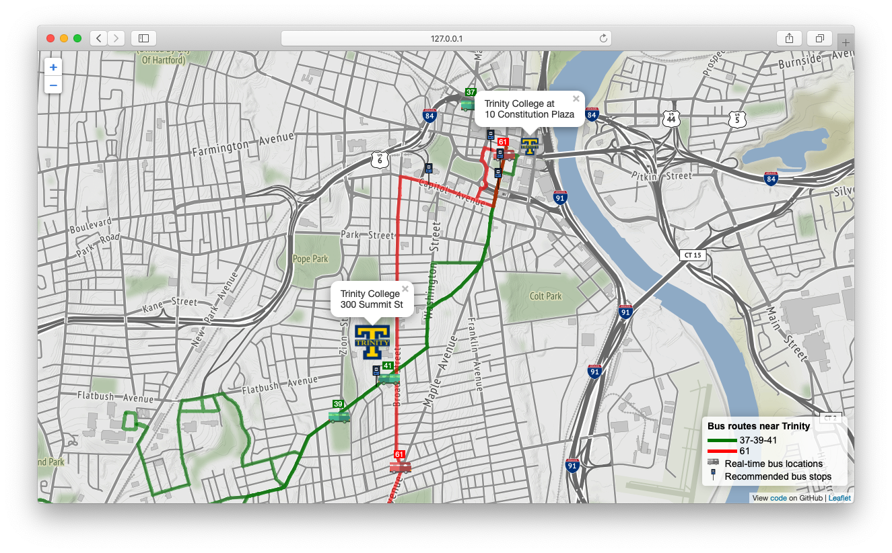
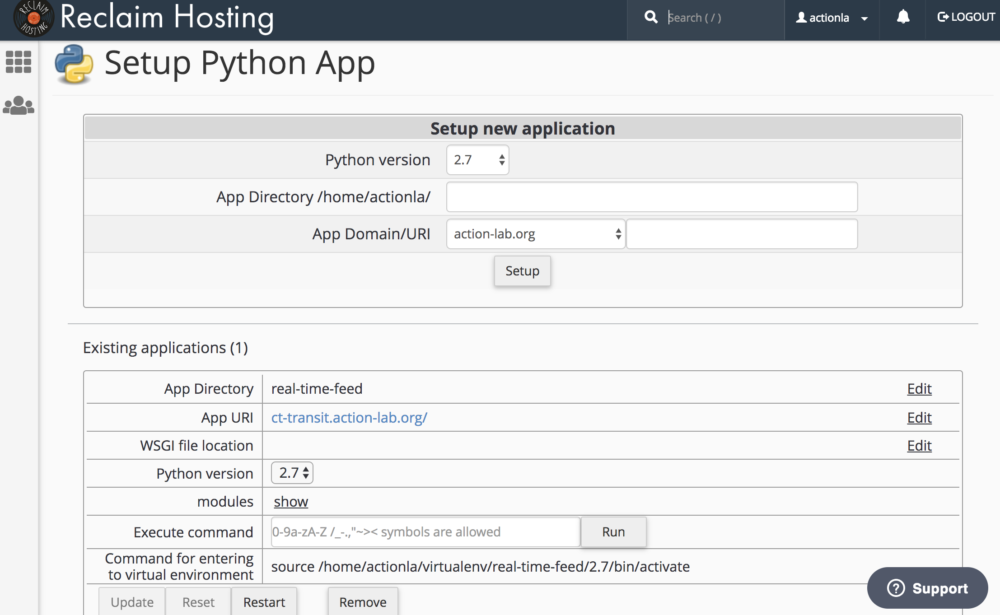

# CTTransit Real Time Bus Data for Trinity College



### Embedded on several pages
- https://action-lab.org/transportation/
- https://cher.trincoll.edu/transportation/
- https://trinfocafe.org/index.php/transportation/
- https://www.trincoll.edu/StudentLife/transportation/

## CT Transit real-time bus location data feed

http://65.213.12.244/realtimefeed/vehicle/vehiclepositions.json

Because the feed is currently **not** provided via https (only http), we cannot fetch this JSON directly from GitHub pages, which is running on secure, due to browser restrictions. This is why we need an intermediary that currently lives on ReclaimHosting https://cttransit.action-lab.org/. It is a Python script, a simple server that fetches http data from CTtransit and outputs it as its own, via https.

#### ReclaimHosting's .htaccess script

```
# DO NOT REMOVE. CLOUDLINUX PASSENGER CONFIGURATION BEGIN
PassengerAppRoot "/home/actionla/real-time-feed"
PassengerBaseURI "/"
PassengerPython "/home/actionla/virtualenv/real-time-feed/2.7/bin/python2.7"
# DO NOT REMOVE. CLOUDLINUX PASSENGER CONFIGURATION END
```



## Maintaining the map
1. Regularly download fresh GTFS data for Hartford from CTTransit Developers (https://www.cttransit.com/about/developers) whenever they update the file (every few months).

1. Simply run `gtfs/Update routes.ipynb` notebook to refresh `gtfs/routes.json`. This way the map knows which `trip_ids` are relevant and should be displayed from the real time feed.

1. Push changes to GitHub repo

### Maintaining the map (`index-old.html`)
1. Regularly download fresh GTFS data for Hartford from CTTransit Developers (https://www.cttransit.com/about/developers) whenever they update the file. Subscribe for alerts. Unzip the archive and place *routes.txt* and *trips.txt* files into **gtfs** folder.

1. Make sure that `route_id`s are up-to-date:
    * Go to `gtfs/routes.txt` and find all relevant bus routes near Trinity (37-39, 41, 61).
    * The first number in line is the `route_id` which is longer 5-digit code (example: 10073 route_id matches the 37-39 route)
    * In `index.html`, find the array variable **routesToDisplay** (as of 2018, around line 102) and make sure the ids listed there match the ones from *trips.txt*. Make sure to put them in single or double quotes (e.g. **'10073'** instead of **10073**).
    ```
    var routesToDisplay = ['10073' /*37-39*/, '10076' /*41*/, '10089' /*61*/]; // Updated Aug 28, 2018
    ```
1. Push changes to GitHub repo
